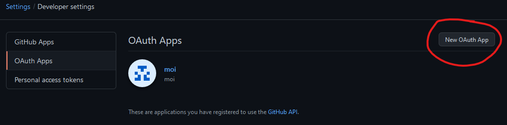
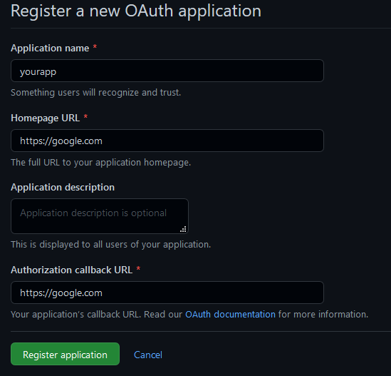
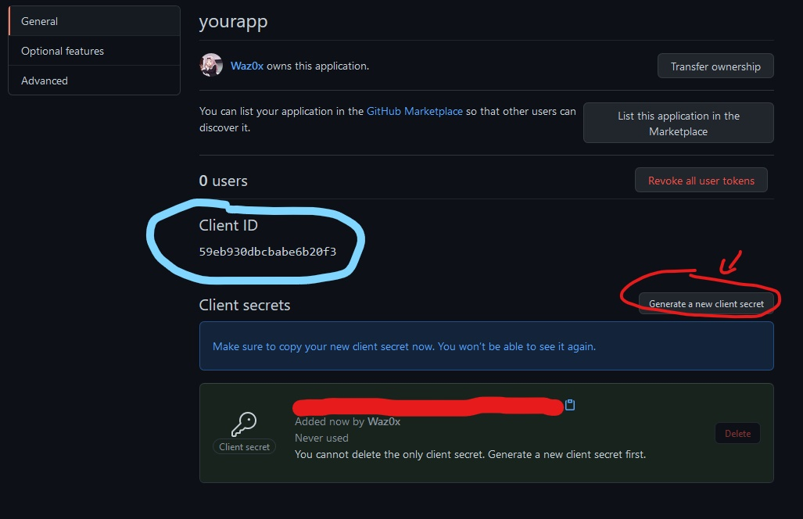

# random_repo

[](https://forthebadge.com) [](https://forthebadge.com) [](https://forthebadge.com)

### How to use it ?
- First you need to create an oauth app [here](https://github.com/settings/developers)
  
  
- When you did it open the script **random_repo.sh** and put in `oauthid` your oauth id and `oauthsecret` your oauth app scret
  

it should look like this
```bash
#!/bin/bash

authid="yourid"
authsecret="yoursecret"

...
```

- Now you need to install dependencies: 
  - Ubuntu and other apt:
    ```bash
    $sudo apt-get install jq
    ```
  - Fedora and other dnf:
    ```bash
    $sudo dnf install
    ```
  - Arch and other pacman/yay:
    ```bash
    $sudo pacman -Syu jq
    or
    $sudo yay jq
    ```
  - If your distrib is'nt here go check this [link](https://stedolan.github.io/jq/download/)

The goal of the oauth it's not to be rate limit after 5 minutes of utilisations.
You have 60 requests per hour without oauth and with oauth connection you have 5,000 requests ([source](https://docs.github.com/en/rest/overview/resources-in-the-rest-api#rate-limiting))

Now just launch the script and voila !

(sometimes it takes a little while, that nothing, probably a thing called optimisation but I don't know how it works)


Why did I did this script ? and why in bash and not other language ?
I don't know a damn thing about it, but leave me in my madness

Next step it's to connect it to a discord webhook so every hour he send you an random repository